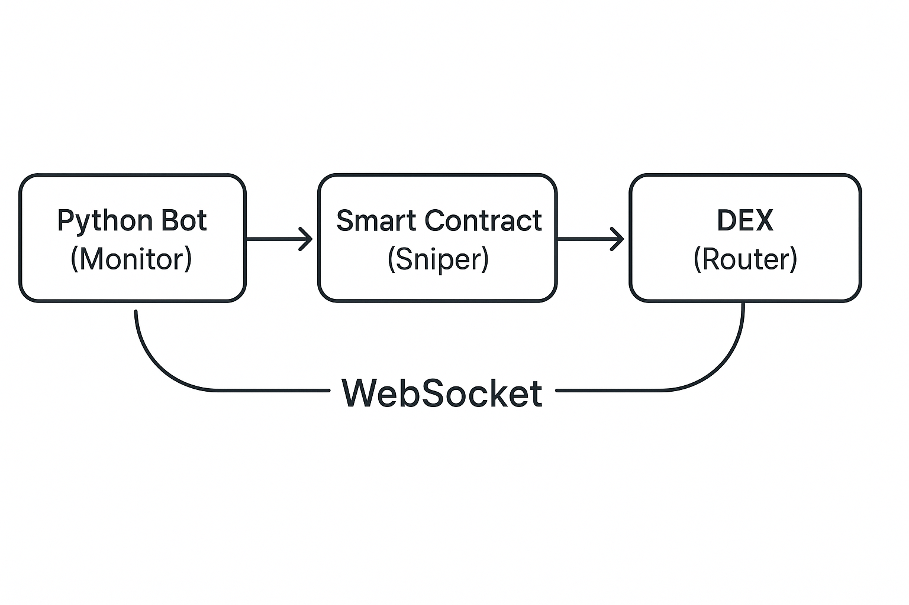

# 🪙️🔫🤖 Crypto Sniping Bot MVP

A high-performance bot for sniping newly created liquidity pools on DEXes. This MVP provides core functionality for automated token trading with safety features.

## 🚀⚡ Features

* **⚡ Lightning‑fast Detection**: Monitors blockchain for new pair creation events
* **🦾 Automated Trading**: Executes buy orders immediately upon liquidity detection
* **🛡️ Safety First**: Built‑in honeypot detection and slippage protection
* **💰 Profit Management**: Configurable take‑profit and stop‑loss levels
* **🌐 Multi‑chain Ready**: Supports Ethereum, BSC, Polygon (one at a time)

## 🏗️🖼️ Architecture



## 📋🔧 Prerequisites

* Node.js v16+ and npm
* Python (developed on 3.13.3)
* Git
* A funded wallet with ETH/BNB for gas and trading
* RPC endpoint (Alchemy, Infura, QuickNode, etc.)

## ⚙️🚀 Quick Start

### 1. Clone and Install

```bash
# Clone the repository
git clone https://github.com/aljazfrancic/crypto-sniping-bot.git
cd crypto-sniping-bot

# Install Node dependencies
npm install

# Install Python dependencies
python -m venv venv
source venv/bin/activate  # On Windows: venv\\Scripts\\activate
pip install -r requirements.txt
```

### 2. Configure Environment

```bash
# Copy example environment file
cp .env.example .env

# Edit .env with your settings
nano .env  # or use your preferred editor
```

**Required settings:**

* `RPC_URL`: Your WebSocket RPC endpoint
* `PRIVATE_KEY`: Your wallet private key (keep this secret!)
* `CHAIN_ID`: Network to use (1=ETH, 56=BSC, 137=Polygon)

### 3. Deploy Smart Contract

```bash
# Compile contracts
npx hardhat compile

# Run tests
npx hardhat test

# Deploy to network
npx hardhat run scripts/deploy.js --network bsc

# Add the deployed contract address to .env
# SNIPER_CONTRACT=0x...
```

### 4. Run the Bot

```bash
# Activate Python environment
source venv/bin/activate  # On Windows: venv\\Scripts\\activate

# Run the bot
python bot/sniper.py
```

## 🧮⚙️ Usage

### Basic Commands

```bash
# Run on testnet first
npx hardhat run scripts/deploy.js --network bscTestnet
python bot/sniper.py

# Check logs
tail -f sniper_bot.log

# Run Python tests
pytest tests/test_bot.py -v
```

### Configuration Options

| Setting          | Description                         | Default |
| ---------------- | ----------------------------------- | ------- |
| `BUY_AMOUNT`     | Amount to spend per snipe (ETH/BNB) | 0.1     |
| `SLIPPAGE`       | Maximum slippage tolerance (%)      | 5       |
| `PROFIT_TARGET`  | Take profit at this gain (%)        | 50      |
| `STOP_LOSS`      | Stop loss at this loss (%)          | 10      |
| `MIN_LIQUIDITY`  | Minimum pool liquidity (ETH/BNB)    | 5       |
| `CHECK_HONEYPOT` | Enable honeypot detection           | true    |

## 🛡️⚠️ Safety Features

1. **Honeypot Detection**

   * Contract bytecode analysis
   * Token function verification
   * External API checks (optional)

2. **Slippage Protection**

   * Configurable maximum slippage
   * Automatic calculation based on liquidity

3. **Position Management**

   * Maximum position limits
   * Automatic profit taking
   * Stop loss protection

## 🧪✔️ Testing

```bash
# Run all tests
npm test                    # Solidity tests
pytest tests/test_bot.py    # Python tests

# Run specific test
npx hardhat test test/test_contracts.js
pytest tests/test_bot.py::TestHoneypotChecker -v
```

## 📊👀 Monitoring

The bot logs all activities to `sniper_bot.log` and displays statistics every minute:

* Total positions opened
* Active positions with P\&L
* Successful trades

## ⚠️🔒 Important Security Notes

1. **Never share your private key**
2. **Use a dedicated wallet for the bot**
3. **Start with small amounts on testnet**
4. **Monitor the bot actively**
5. **Keep your dependencies updated**

## 🔧❓ Troubleshooting

### Common Issues

**"No contract code at address"**

* Ensure the sniper contract is deployed
* Verify the address in your .env file

**"Insufficient funds"**

* Check wallet balance for both native token and gas
* Ensure BUY\_AMOUNT is less than your balance

**"Connection lost"**

* Check your RPC endpoint
* Use a reliable WebSocket provider

**High gas fees**

* Adjust GAS\_PRICE\_MULTIPLIER
* Consider using a different network

## 🛠️💡 Development

### Project Structure

```
crypto-sniping-bot/
├── contracts/         # Solidity smart contracts
├── bot/               # Python bot implementation
├── tests/             # Test files
├── scripts/           # Deployment and utility scripts
├── abi/               # Contract ABIs (generated)
└── deployments/       # Deployment artifacts
```

### Adding Features

1. Create a new branch
2. Implement your feature
3. Add tests
4. Update documentation
5. Submit a pull request

### Roadmap

* [Crypto‑Forecasting Build Guide 🛣️](crpyto-forecasting-build-guide.md)

## 📜⚖️ License

This project is for educational purposes. Use at your own risk.

## 🚨📢 Disclaimer

**IMPORTANT**: Cryptocurrency trading carries significant risk. This bot is provided as‑is with no guarantees. You may lose your entire investment. Always:

* Test thoroughly on testnet first
* Start with small amounts
* Never invest more than you can afford to lose
* Understand the code before using it
* Be aware of local regulations

## 🤝✨ Contributing

Contributions are welcome! Please:

1. Fork the repository
2. Create a feature branch
3. Add tests for new functionality
4. Ensure all tests pass
5. Submit a pull request

## 📞💬 Support

* Open an issue for bugs
* Check existing issues before creating new ones
* [Discord](https://discord.gg/bZXer5ZttK)

---

**Remember**: This is a powerful tool. Use it responsibly and always DYOR (Do Your Own Research)! 🌟
