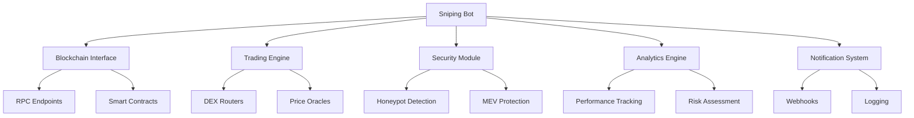

# 🚀 Crypto Sniping Bot - Enterprise Edition

A production-ready, enterprise-grade cryptocurrency sniping bot built with Python for automated trading on decentralized exchanges (DEXs). Features comprehensive security, analytics, monitoring, and fault tolerance.

[](https://python.org)
[](LICENSE)
[]()
[]()
[]()

## ✨ Key Features

### 🔒 **Enterprise Security**
- **Private Key Protection**: Advanced detection and rejection of test/dangerous keys
- **MEV Protection**: Shields against frontrunning and sandwich attacks  
- **Honeypot Detection**: Comprehensive token safety analysis
- **Gas Price Manipulation Protection**: Guards against artificial gas spikes
- **Contract Verification**: Validates contract authenticity and safety

### 📊 **Advanced Analytics & Monitoring**
- **Real-time Performance Tracking**: Win rate, profit/loss, gas fees
- **SQLite Database**: Persistent storage for all trade records
- **Daily/Weekly Reports**: Automated analytics generation
- **Performance Metrics**: Comprehensive statistics and insights
- **Risk Assessment**: Token-specific risk analysis

### 🏗️ **Production-Ready Infrastructure**
- **Rate Limiting**: Prevents RPC endpoint overload
- **Circuit Breaker**: Handles failing services gracefully
- **Retry Logic**: Exponential backoff with jitter
- **Health Monitoring**: Continuous connection health checks
- **Auto Failover**: Backup RPC endpoint support

### 🔔 **Notifications & Alerting**
- **Webhook Integration**: Slack, Discord, custom endpoints
- **Real-time Alerts**: Trade notifications, errors, performance updates
- **Structured Logging**: Comprehensive logging with configurable levels
- **Performance Notifications**: Threshold-based alerting

### 🧪 **Comprehensive Testing**
- **100+ Test Cases**: Security, functionality, integration tests
- **Continuous Integration**: Automated testing pipeline
- **Security Test Suite**: 18 dedicated security tests
- **Clean Test Environment**: Safe testing without real funds exposure

## 🚀 Quick Start

### Prerequisites
- Python 3.8+
- Node.js 16+ (for smart contracts)
- Git

### 1. Clone Repository
```bash
git clone https://github.com/your-username/crypto-sniping-bot.git
cd crypto-sniping-bot
```

### 2. Setup Environment
```bash
# Install dependencies and configure environment
python setup_tests.py

# Or manual setup
pip install -r requirements.txt
```

### 3. Configure Bot
```bash
# Copy and edit configuration
cp production.config.env .env
# Edit .env with your settings (see Configuration section)
```

### 4. Verify Setup
```bash
# Run comprehensive tests
python test_clean.py

# Or run all tests with coverage
python run_tests.py
```

### 5. Deploy Smart Contracts (Optional)
```bash
# For enhanced trading features
npm install
npx hardhat compile
npx hardhat deploy --network mainnet
```

## ⚙️ Configuration

### Environment Variables

**Blockchain Settings**
```env
RPC_URL=https://mainnet.infura.io/v3/your-key
BACKUP_RPC_URLS=https://eth.llamarpc.com,https://rpc.ankr.com/eth
CHAIN_ID=1
PRIVATE_KEY=your-private-key
WALLET_ADDRESS=your-wallet-address
```

**Trading Parameters**
```env
MIN_LIQUIDITY_ETH=1.0
MAX_GAS_PRICE=100
SLIPPAGE_TOLERANCE=5.0
MAX_TRADE_AMOUNT=1.0
TRADE_AMOUNT_ETH=0.1
```

**Performance & Security**
```env
MAX_RPC_CALLS_PER_SECOND=10
MAX_CONCURRENT_TRADES=5
ENABLE_MEV_PROTECTION=true
HONEYPOT_CHECK_ENABLED=true
```

**Monitoring & Alerts**
```env
WEBHOOK_URL=https://hooks.slack.com/services/your/webhook
DATABASE_URL=sqlite:///sniper_data.db
LOG_LEVEL=INFO
```

See [configuration.md](docs/configuration.md) for detailed configuration options.

## 🏃‍♂️ Running the Bot

### Production Mode
```bash
# Start the bot
python -m bot.sniper

# With custom config file
python -m bot.sniper --config production.config.env

# Background mode with logging
nohup python -m bot.sniper > sniper.log 2>&1 &
```

### Development Mode
```bash
# Run with debug logging
python -m bot.sniper --debug

# Test mode (paper trading)
python -m bot.sniper --test-mode
```

### Trading Strategies
```bash
# Liquidity sniping
python -m bot.sniper --strategy liquidity

# New pair detection
python -m bot.sniper --strategy new-pairs

# Price impact sniping
python -m bot.sniper --strategy price-impact
```

## 🧪 Testing

The bot includes a comprehensive testing suite:

### Quick Verification
```bash
# Comprehensive integration test
python test_clean.py
```

### Test Categories
```bash
# All tests with coverage
python run_tests.py

# Security tests only
python run_tests.py security

# Unit tests only  
python run_tests.py unit

# Integration tests only
python run_tests.py integration
```

### Windows Users
```cmd
# Run tests using batch file
run_tests.bat clean
```

See [TESTING.md](TESTING.md) for detailed testing documentation.

## 📊 Analytics Dashboard

The bot includes a built-in analytics system:

### View Performance
```python
from bot.analytics import TradingAnalytics

analytics = TradingAnalytics()
metrics = analytics.calculate_performance_metrics()
print(f"Win Rate: {metrics.win_rate:.2f}%")
print(f"Total Profit: {metrics.total_profit_loss:.4f} ETH")
```

### Generate Reports
```bash
# Daily summary
python -c "from bot.analytics import TradingAnalytics; TradingAnalytics().generate_report(days=1)"

# Weekly report
python -c "from bot.analytics import TradingAnalytics; TradingAnalytics().generate_report(days=7)"
```

## 🏗️ Architecture



### Core Modules

- **`bot/sniper.py`** - Main bot orchestration and pair monitoring
- **`bot/blockchain.py`** - Blockchain interface with health monitoring
- **`bot/trading.py`** - Trading execution engine
- **`bot/security.py`** - Security and risk management
- **`bot/analytics.py`** - Performance tracking and reporting
- **`bot/utils.py`** - Utilities (rate limiting, circuit breaker, retry logic)

## 🔒 Security Features

### Private Key Protection
- Detects and rejects known test private keys
- Prevents accidental exposure of funds
- Validates key formats and checksums

### MEV Protection
- Priority fee optimization
- Slippage protection
- Transaction timing randomization

### Honeypot Detection
- Token transfer restrictions analysis
- Liquidity lock verification
- Contract ownership checks
- Trading simulation

### Risk Management
- Position sizing limits
- Stop-loss mechanisms
- Gas price capping
- Maximum slippage enforcement

## 🚀 Performance Optimizations

### Rate Limiting
- Configurable RPC call limits
- Request queue management
- Burst protection

### Circuit Breakers
- Automatic failure detection
- Service isolation
- Graceful degradation

### Caching
- Contract instance caching
- ABI caching
- Price data caching

### Async Operations
- Non-blocking I/O
- Concurrent trading
- Parallel market monitoring

## 📈 Monitoring & Alerts

### Performance Metrics
- Trade success rate
- Average profit per trade
- Gas efficiency
- Response times

### Alert Triggers
- Large profit/loss events
- System errors
- Performance degradation
- Security threats

### Notification Channels
- Slack webhooks
- Discord webhooks
- Email notifications
- Custom webhook endpoints

## 🛠️ Development

### Setup Development Environment
```bash
# Clone and setup
git clone https://github.com/your-username/crypto-sniping-bot.git
cd crypto-sniping-bot
python setup_tests.py

# Install development dependencies
pip install -r requirements.txt
```

### Code Quality
```bash
# Format code
black bot/ tests/

# Type checking
mypy bot/

# Linting
pylint bot/

# Security scan
bandit -r bot/
```

### Testing During Development
```bash
# Quick test during development
python run_tests.py unit

# Full test suite before commit
python test_clean.py
pytest tests/ -v
```

## 📚 Documentation

- **[Installation Guide](installation.md)** - Detailed installation instructions
- **[Configuration](configuration.md)** - Complete configuration reference
- **[Security Guide](security.md)** - Security best practices
- **[API Reference](api.md)** - Complete API documentation
- **[Architecture](architecture.md)** - System architecture overview
- **[Development](development.md)** - Development guidelines
- **[Troubleshooting](troubleshooting.md)** - Common issues and solutions
- **[Testing Guide](TESTING.md)** - Comprehensive testing documentation

## 🤝 Contributing

1. Fork the repository
2. Create a feature branch (`git checkout -b feature/amazing-feature`)
3. Run tests (`python test_clean.py`)
4. Commit changes (`git commit -m 'Add amazing feature'`)
5. Push to branch (`git push origin feature/amazing-feature`)
6. Open a Pull Request

## ⚠️ Disclaimer

This software is for educational and research purposes only. Cryptocurrency trading involves substantial risk of loss. The authors and contributors are not responsible for any financial losses incurred through the use of this software.

**Use at your own risk. Never invest more than you can afford to lose.**

## 📄 License

This project is licensed under the MIT License - see the [LICENSE](LICENSE) file for details.

## 🙏 Acknowledgments

- [Web3.py](https://github.com/ethereum/web3.py) - Ethereum Python library
- [AsyncIO](https://docs.python.org/3/library/asyncio.html) - Asynchronous I/O framework
- [Pytest](https://pytest.org/) - Testing framework
- [Hardhat](https://hardhat.org/) - Ethereum development environment

## 📞 Support

- **Issues**: [GitHub Issues](https://github.com/your-username/crypto-sniping-bot/issues)
- **Discussions**: [GitHub Discussions](https://github.com/your-username/crypto-sniping-bot/discussions)
- **Security**: Please report security issues privately to security@yourproject.com

---

**⭐ Star this repository if it helped you!**
