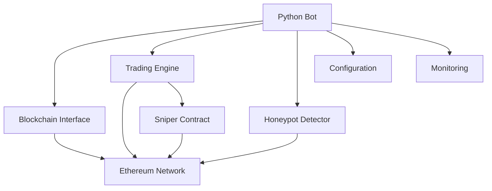

# Architecture Documentation

## System Overview

The Crypto Sniping Bot is a high-performance automated trading system designed to monitor and trade newly created liquidity pools on decentralized exchanges (DEXes). The system combines smart contracts for secure trading with a Python-based monitoring and execution engine.

## Architecture Diagram

## Core Components

### 1. Smart Contracts (`contracts/`)

#### Sniper Contract (`Sniper.sol`)
- Handles token buying and selling operations
- Implements safety checks and slippage protection
- Manages token blacklisting
- Controls withdrawals and emergency functions

#### Mock Contracts (`mocks/`)
- `MockWETH.sol`: Wrapped ETH implementation
- `MockERC20.sol`: ERC20 token implementation
- `MockUniswapV2Pair.sol`: DEX pair simulation
- `MockUniswapV2Factory.sol`: DEX factory simulation
- `MockUniswapV2Router.sol`: DEX router simulation

### 2. Python Bot (`bot/`)

#### Blockchain Interface (`blockchain.py`)
- Manages blockchain interactions
- Handles RPC communication
- Provides token and balance queries
- Manages transaction signing and sending

#### Trading Engine (`trading.py`)
- Executes buy/sell operations
- Manages position tracking
- Implements trading strategies
- Handles slippage calculations

#### Honeypot Detection (`honeypot.py`)
- Analyzes token contracts
- Checks for malicious functions
- Verifies token liquidity
- Implements blacklist checking

#### Configuration (`config.py`)
- Manages environment variables
- Validates configuration settings
- Provides network-specific parameters
- Handles private key management

#### Monitoring (`monitoring.py`)
- Logs trading activities
- Tracks performance metrics
- Manages backups
- Provides real-time statistics

## Data Flow

1. **Event Monitoring**
   - Bot monitors blockchain for new liquidity pools
   - Filters events based on configured criteria
   - Identifies potential trading opportunities

2. **Safety Checks**
   - Analyzes token contract code
   - Verifies liquidity levels
   - Checks for honeypot characteristics
   - Validates slippage parameters

3. **Trade Execution**
   - Calculates optimal trade parameters
   - Executes buy transaction via Sniper contract
   - Monitors transaction status
   - Updates position tracking

4. **Position Management**
   - Tracks token balances
   - Monitors price movements
   - Executes take-profit/stop-loss
   - Manages emergency sells

## Security Features

### Smart Contract Security
- Reentrancy protection
- Access control
- Slippage limits
- Emergency functions
- Blacklist management

### Bot Security
- Private key protection
- Transaction validation
- Honeypot detection
- Liquidity verification
- Slippage protection

## Network Support

### Supported Networks
- Ethereum Mainnet
- BSC (Binance Smart Chain)
- Polygon

### Network-Specific Parameters
- Chain IDs
- Router addresses
- Factory addresses
- WETH addresses
- Gas price strategies

## Performance Considerations

### Optimization Techniques
- Efficient event filtering
- Batch transaction processing
- Gas price optimization
- Caching mechanisms
- Parallel processing

### Resource Management
- Memory usage optimization
- Connection pooling
- Error handling
- Rate limiting
- Backup strategies

## Monitoring and Maintenance

### Logging
- Transaction logs
- Error tracking
- Performance metrics
- Position updates
- System health

### Backup and Recovery
- Configuration backups
- Position state backups
- Recovery procedures
- Data consistency checks

## Development Guidelines

### Code Organization
- Modular architecture
- Clear separation of concerns
- Consistent naming conventions
- Comprehensive documentation
- Type hints and validation

### Testing Strategy
- Unit tests
- Integration tests
- Contract tests
- Performance tests
- Security audits

## Deployment Architecture

### Requirements
- Node.js environment
- Python environment
- RPC endpoint
- Funded wallet
- Storage for logs and backups

### Deployment Process
1. Contract deployment
2. Configuration setup
3. Environment preparation
4. Bot initialization
5. Monitoring setup

## Future Considerations

### Scalability
- Multi-chain support
- Advanced trading strategies
- Enhanced monitoring
- Performance optimization
- Additional safety features

### Integration
- External APIs
- Price feeds
- Trading signals
- Analytics platforms
- Alert systems 