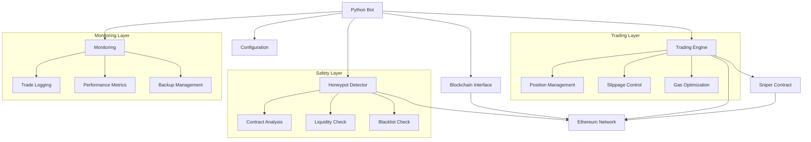

# 🏗️ Architecture

## 📋 System Overview

High-performance automated trading system for DEX liquidity pools.

## 📊 Architecture Diagram

## 🧩 Core Components

### 📜 Smart Contracts
- `Sniper.sol`: Main trading contract
- `MockWETH.sol`: Wrapped ETH
- `MockERC20.sol`: Token implementation
- `MockUniswapV2Pair.sol`: DEX pair
- `MockUniswapV2Factory.sol`: DEX factory
- `MockUniswapV2Router.sol`: DEX router

### 🤖 Python Bot
- `blockchain.py`: Blockchain interface
- `trading.py`: Trading engine
- `honeypot.py`: Honeypot detection
- `config.py`: Configuration
- `monitoring.py`: Monitoring

## 🔄 Data Flow

1. **Event Monitoring**
   - Monitor new pools
   - Filter events
   - Identify opportunities

2. **Safety Checks**
   - Analyze contracts
   - Verify liquidity
   - Check honeypot
   - Validate slippage

3. **Trade Execution**
   - Calculate parameters
   - Execute buy
   - Monitor status
   - Track position

4. **Position Management**
   - Track balances
   - Monitor prices
   - Execute take-profit/stop-loss
   - Handle emergency sells

## 🔒 Security Features

### 📜 Smart Contract
- Reentrancy protection
- Access control
- Slippage limits
- Emergency functions
- Blacklist management

### 🤖 Bot
- Private key protection
- Transaction validation
- Honeypot detection
- Liquidity verification
- Slippage protection

## 🌐 Network Support

### 📡 Supported Networks

| Network | Chain ID | Router Address | Factory Address | WETH Address |
|---------|----------|----------------|-----------------|--------------|
| Ethereum | 1 | 0x7a250d5630B4cF539739dF2C5dAcb4c659F2488D | 0x5C69bEe701ef814a2B6a3EDD4B1652CB9cc5aA6f | 0xC02aaA39b223FE8D0A0e5C4F27eAD9083C756Cc2 |
| BSC | 56 | 0x10ED43C718714eb63d5aA57B78B54704E256024E | 0xcA143Ce32Fe78f1f7019d7d551a6402fC5350c73 | 0xbb4CdB9CBd36B01bD1cBaEBF2De08d9173bc095c |
| Polygon | 137 | 0xa5E0829CaCEd8fFDD4De3c43696c57F7D7A678ff | 0x5757371414417b8C6CAad45bAeF941aBc7d3Ab32 | 0x0d500B1d8E8eF31E21C99d1Db9A6444d3ADf1270 |

### ⚙️ Network Parameters

#### ⛽ Gas Strategies
- Ethereum: Dynamic with EIP-1559
- BSC: Fixed with multiplier
- Polygon: Priority fee based

#### 🔌 RPC Requirements
- WebSocket for events
- HTTP for transactions
- Backup providers

#### ⚡ Network Limits
- Ethereum: High gas, slow blocks
- BSC: Low gas, fast blocks
- Polygon: Lowest gas, fastest blocks

## ⚡ Performance

### 🚀 Optimization
- Efficient event filtering
- Batch transactions
- Gas optimization
- Caching
- Parallel processing

### 💾 Resources
- Memory optimization
- Connection pooling
- Error handling
- Rate limiting
- Backup strategies

## 📊 Monitoring

### 📝 Logging
- Transaction logs
- Error tracking
- Performance metrics
- Position updates
- System health

### 💾 Backup
- Config backups
- Position state
- Recovery procedures
- Data consistency

## 👨‍💻 Development

### 📝 Code
- Modular design
- Clear separation
- Consistent naming
- Documentation
- Type hints

### 🧪 Testing
- Unit tests
- Integration tests
- Contract tests
- Performance tests
- Security audits

## 🚀 Deployment

### 📋 Requirements
- Node.js
- Python
- RPC endpoint
- Funded wallet
- Storage

### 📦 Process
1. Deploy contract
2. Configure settings
3. Prepare environment
4. Initialize bot
5. Setup monitoring

## 🔮 Future

### 📈 Scalability
- Multi-chain
- Advanced strategies
- Enhanced monitoring
- Performance
- Safety features

### 🔌 Integration
- External APIs
- Price feeds
- Trading signals
- Analytics
- Alerts 