# 🏗️ Architecture Guide

This document provides a comprehensive overview of the Crypto Sniping Bot enterprise edition architecture, detailing all components, their interactions, and design patterns.

## 🌟 System Overview

The bot follows a modular, microservice-inspired architecture designed for:
- **Scalability**: Handle high-frequency trading operations
- **Reliability**: Fault-tolerant with graceful degradation
- **Security**: Defense-in-depth security model
- **Maintainability**: Clean, testable, and extensible code
- **Performance**: Optimized for speed and efficiency

## 🏛️ High-Level Architecture

```mermaid
graph TB
    subgraph "🎯 Crypto Sniping Bot Enterprise Architecture"
        direction TB

        subgraph "🚀 Application Layer"
            SNIPER["🤖 Sniper Bot<br/>Main Orchestrator"]
            SNIPER --> BLOCKCHAIN["📊 Blockchain Interface<br/>Web3 Integration"]
            SNIPER --> TRADING["💰 Trading Engine<br/>Execution Logic"]
            SNIPER --> SECURITY["🛡️ Security Module<br/>Risk Management"]
            SNIPER --> ANALYTICS["📈 Analytics Engine<br/>Performance Tracking"]
            SNIPER --> NOTIFICATIONS["🔔 Notification System<br/>Alerts & Webhooks"]
        end

        subgraph "🔧 Infrastructure Layer"
            UTILS["⚙️ Utilities<br/>Rate Limiter, Circuit Breaker"]
            CONFIG["📋 Configuration<br/>Environment Management"]
            EXCEPTIONS["🚨 Exception Handling<br/>Error Management"]
            LOGGING["📝 Logging System<br/>Structured Logging"]
        end

        subgraph "🧪 Testing & QA Layer"
            TESTS["🧪 Test Suite<br/>100+ Test Cases"]
            SECURITY_TESTS["🔒 Security Tests<br/>18 Security Tests"]
            INTEGRATION_TESTS["🔗 Integration Tests<br/>End-to-End Testing"]
        end

        subgraph "💾 Data Layer"
            DATABASE["🗄️ Database<br/>SQLite/PostgreSQL"]
            CACHE["⚡ Cache Layer<br/>Contract & Price Cache"]
            METRICS["📊 Metrics Storage<br/>Performance Data"]
        end

        subgraph "🌐 External Services"
            RPC["🔗 RPC Endpoints<br/>Blockchain Nodes"]
            DEXES["🏪 DEX Protocols<br/>Uniswap, SushiSwap"]
            WEBHOOKS["📡 Webhook Endpoints<br/>Slack, Discord"]
            ORACLES["🔮 Price Oracles<br/>Price Feeds"]
        end
    end

    %% Connections
    BLOCKCHAIN --> RPC
    TRADING --> DEXES
    NOTIFICATIONS --> WEBHOOKS
    ANALYTICS --> DATABASE
    SECURITY --> ORACLES
    UTILS --> CACHE
    CONFIG --> LOGGING

    %% Styling
    classDef appLayer fill:#e3f2fd,stroke:#1976d2,stroke-width:3px,color:#0d47a1
    classDef infraLayer fill:#f3e5f5,stroke:#7b1fa2,stroke-width:2px,color:#4a148c
    classDef testLayer fill:#e8f5e8,stroke:#388e3c,stroke-width:2px,color:#1b5e20
    classDef dataLayer fill:#fff3e0,stroke:#f57c00,stroke-width:2px,color:#e65100
    classDef externalLayer fill:#fce4ec,stroke:#c2185b,stroke-width:2px,color:#880e4f

    class SNIPER,BLOCKCHAIN,TRADING,SECURITY,ANALYTICS,NOTIFICATIONS appLayer
    class UTILS,CONFIG,EXCEPTIONS,LOGGING infraLayer
    class TESTS,SECURITY_TESTS,INTEGRATION_TESTS testLayer
    class DATABASE,CACHE,METRICS dataLayer
    class RPC,DEXES,WEBHOOKS,ORACLES externalLayer
```



## 📦 Core Components

### 🤖 Sniper Bot (`bot/sniper.py`)
The main orchestrator that coordinates all trading operations.

**Key Responsibilities:**
- Monitor blockchain for new liquidity pairs
- Coordinate trading decisions
- Manage bot lifecycle and health
- Handle graceful shutdown

**Design Patterns:**
- **Observer Pattern**: Subscribes to blockchain events
- **Command Pattern**: Executes trading commands
- **State Machine**: Manages bot operational states

```python
class SniperBot:
    def __init__(self, config: Config):
        self.blockchain = BlockchainInterface(config)
        self.trading_engine = TradingEngine(config)
        self.security = SecurityManager(config)
        self.analytics = TradingAnalytics(config)
        self.notifications = NotificationSystem(config)
        
    async def start(self):
        """Start the sniping bot with all components"""
        await self._initialize_components()
        await self._start_monitoring()
```

### 📊 Blockchain Interface (`bot/blockchain.py`)
Handles all blockchain interactions with reliability and performance optimization.

**Features:**
- **Health Monitoring**: Continuous RPC endpoint health checks
- **Automatic Failover**: Switches to backup RPC endpoints
- **Connection Pooling**: Efficient connection management
- **Rate Limiting**: Prevents RPC endpoint overload

```python
class BlockchainInterface:
    def __init__(self, config: Config):
        self.rate_limiter = RateLimiter(config.max_rpc_calls_per_second)
        self.circuit_breaker = CircuitBreaker()
        self.health_monitor = HealthMonitor()
        
    async def get_latest_block(self) -> int:
        """Get latest block with rate limiting and circuit breaker"""
        async with self.rate_limiter:
            return await self.circuit_breaker.call(self._get_block)
```

### 💰 Trading Engine (`bot/trading.py`)
Executes trades with sophisticated order management and risk controls.

**Components:**
- **Order Manager**: Handles buy/sell order execution
- **Slippage Controller**: Manages price impact
- **Gas Optimizer**: Optimizes transaction fees
- **Position Manager**: Tracks open positions

```python
class TradingEngine:
    def __init__(self, config: Config):
        self.order_manager = OrderManager(config)
        self.slippage_controller = SlippageController(config)
        self.gas_optimizer = GasOptimizer(config)
        
    async def execute_buy_order(self, token_address: str, amount: float):
        """Execute buy order with all safety checks"""
        # Pre-trade validation
        await self.security.validate_token(token_address)
        
        # Execute with slippage protection
        return await self.order_manager.buy(token_address, amount)
```

### 🛡️ Security Module (`bot/security.py`)
Comprehensive security framework protecting against various threats.

**Security Components:**
- **Private Key Validator**: Prevents dangerous key usage
- **Honeypot Detector**: Identifies scam tokens
- **MEV Protector**: Shields against MEV attacks
- **Contract Analyzer**: Validates smart contract safety

```python
class SecurityManager:
    def __init__(self, config: Config):
        self.private_key_validator = PrivateKeyValidator()
        self.honeypot_detector = HoneypotDetector(config)
        self.mev_protector = MEVProtector(config)
        self.contract_analyzer = ContractAnalyzer(config)
        
    async def validate_token(self, token_address: str) -> bool:
        """Comprehensive token security validation"""
        validations = [
            self.honeypot_detector.check(token_address),
            self.contract_analyzer.analyze(token_address),
            self._check_liquidity_locks(token_address)
        ]
        results = await asyncio.gather(*validations)
        return all(results)
```

### 📈 Analytics Engine (`bot/analytics.py`)
Advanced performance tracking and reporting system.

**Capabilities:**
- **Real-time Metrics**: Live performance tracking
- **Historical Analysis**: Long-term performance trends
- **Risk Analytics**: Portfolio risk assessment
- **Report Generation**: Automated report creation

```python
class TradingAnalytics:
    def __init__(self, config: Config):
        self.database = Database(config.database_url)
        self.metrics_collector = MetricsCollector()
        
    async def record_trade(self, trade_data: TradeData):
        """Record trade for analytics"""
        await self.database.save_trade(trade_data)
        self.metrics_collector.update_metrics(trade_data)
        
    def calculate_performance_metrics(self) -> PerformanceMetrics:
        """Calculate comprehensive performance metrics"""
        return PerformanceMetrics(
            win_rate=self._calculate_win_rate(),
            total_profit_loss=self._calculate_total_pnl(),
            average_trade_time=self._calculate_avg_trade_time(),
            sharpe_ratio=self._calculate_sharpe_ratio()
        )
```

## 🔧 Infrastructure Components

### ⚙️ Utilities (`bot/utils.py`)
Production-ready utilities for reliability and performance.

**Components:**
- **Rate Limiter**: Token bucket algorithm implementation
- **Circuit Breaker**: Fault tolerance mechanism  
- **Retry Logic**: Exponential backoff with jitter
- **Health Monitor**: Service health checking

```python
class RateLimiter:
    def __init__(self, max_calls: int, time_window: int):
        self.max_calls = max_calls
        self.time_window = time_window
        self.calls = []
        
    async def __aenter__(self):
        """Async context manager for rate limiting"""
        await self._wait_if_needed()
        self.calls.append(time.time())
        
class CircuitBreaker:
    def __init__(self, failure_threshold: int = 5, recovery_timeout: int = 60):
        self.failure_threshold = failure_threshold
        self.recovery_timeout = recovery_timeout
        self.failure_count = 0
        self.state = CircuitState.CLOSED
        
    async def call(self, func, *args, **kwargs):
        """Execute function with circuit breaker protection"""
        if self.state == CircuitState.OPEN:
            if self._should_attempt_reset():
                self.state = CircuitState.HALF_OPEN
            else:
                raise CircuitBreakerOpenError()
```

### 📋 Configuration Management (`bot/config.py`)
Robust configuration system with validation and security.

**Features:**
- **Environment-based Configuration**: Multiple environment support
- **Security Validation**: Automatic security setting validation
- **Type Safety**: Pydantic-based type validation
- **Dynamic Reloading**: Hot configuration updates

```python
class Config(BaseSettings):
    # Blockchain settings
    rpc_url: str
    backup_rpc_urls: List[str] = []
    chain_id: int = 1
    private_key: str
    wallet_address: str
    
    # Trading settings
    min_liquidity_eth: float = 1.0
    max_gas_price: int = 100
    slippage_tolerance: float = 5.0
    
    # Security settings
    enable_mev_protection: bool = True
    honeypot_check_enabled: bool = True
    
    class Config:
        env_file = ".env"
        
    def __post_init__(self):
        """Post-initialization validation"""
        self._validate_private_key()
        self._validate_rpc_endpoints()
        self._validate_security_settings()
```

## 📊 Data Architecture

### 🗄️ Database Layer
Flexible database abstraction supporting multiple backends.

**Supported Databases:**
- **SQLite**: Default for development and small deployments
- **PostgreSQL**: Production-grade for high-volume trading
- **MySQL**: Alternative production option

```python
class Database:
    def __init__(self, database_url: str):
        self.engine = create_async_engine(database_url)
        self.session_factory = async_sessionmaker(self.engine)
        
    async def save_trade(self, trade: TradeData):
        """Save trade data with proper error handling"""
        async with self.session_factory() as session:
            try:
                session.add(Trade.from_trade_data(trade))
                await session.commit()
            except Exception as e:
                await session.rollback()
                raise DatabaseError(f"Failed to save trade: {e}")
```

### ⚡ Caching Strategy
Multi-layered caching for performance optimization.

**Cache Types:**
- **Contract Cache**: Smart contract instances and ABIs
- **Price Cache**: Recent price data with TTL
- **Result Cache**: Expensive computation results

```python
class CacheManager:
    def __init__(self):
        self.contract_cache = TTLCache(maxsize=1000, ttl=3600)
        self.price_cache = TTLCache(maxsize=500, ttl=30)
        self.abi_cache = TTLCache(maxsize=100, ttl=86400)
        
    async def get_contract(self, address: str) -> Contract:
        """Get contract with caching"""
        if address in self.contract_cache:
            return self.contract_cache[address]
            
        contract = await self._load_contract(address)
        self.contract_cache[address] = contract
        return contract
```

## 🔔 Communication Architecture

### 📡 Notification System
Multi-channel notification system with reliability features.

**Channels:**
- **Slack Integration**: Rich message formatting
- **Discord Webhooks**: Community notifications
- **Custom Webhooks**: Flexible integration options
- **Email Notifications**: Critical alert delivery

```python
class NotificationSystem:
    def __init__(self, config: Config):
        self.webhook_client = WebhookClient(config.webhook_url)
        self.rate_limiter = RateLimiter(max_calls=30, time_window=60)
        self.circuit_breaker = CircuitBreaker()
        
    async def send_trade_notification(self, trade: TradeData):
        """Send trade notification with rate limiting"""
        message = self._format_trade_message(trade)
        async with self.rate_limiter:
            await self.circuit_breaker.call(
                self.webhook_client.send, message
            )
```

## 🧪 Testing Architecture

### 🔍 Test Categories
Comprehensive testing strategy covering all aspects.

**Test Types:**
1. **Unit Tests**: Individual component testing
2. **Integration Tests**: Component interaction testing
3. **Security Tests**: Security feature validation
4. **Performance Tests**: Load and stress testing
5. **End-to-End Tests**: Full workflow testing

```python
# Security test example
class TestSecurity:
    async def test_private_key_validation(self):
        """Test private key security validation"""
        validator = PrivateKeyValidator()
        
        # Test dangerous key rejection
        dangerous_key = "0xac0974bec39a17e36ba4a6b4d238ff944bacb478cbed5efcae784d7bf4f2ff80"
        with pytest.raises(DangerousPrivateKeyError):
            validator.validate(dangerous_key)
            
        # Test valid key acceptance
        valid_key = generate_valid_private_key()
        assert validator.validate(valid_key) == True
```

### 🎯 Test Infrastructure
Automated testing with CI/CD integration.

**Components:**
- **Pytest Framework**: Advanced testing capabilities
- **Mock Services**: Isolated testing environment
- **Coverage Reporting**: Comprehensive coverage analysis
- **Performance Benchmarking**: Performance regression detection

## 🚀 Performance Architecture

### ⚡ Async Programming Model
Fully asynchronous architecture for high concurrency.

**Benefits:**
- **Non-blocking I/O**: Efficient resource utilization
- **High Concurrency**: Handle multiple operations simultaneously
- **Scalability**: Linear performance scaling

```python
async def main():
    """Main async entry point"""
    config = Config()
    
    # Initialize all components asynchronously
    bot = SniperBot(config)
    
    # Start all services concurrently
    tasks = [
        bot.start_trading(),
        bot.start_monitoring(),
        bot.start_analytics()
    ]
    
    await asyncio.gather(*tasks)
```

### 🔄 Resource Management
Efficient resource utilization and cleanup.

**Strategies:**
- **Connection Pooling**: Reuse expensive connections
- **Memory Management**: Automatic cleanup of cached data
- **CPU Optimization**: Efficient algorithm implementations
- **I/O Optimization**: Batch operations where possible

## ⚖️ Architectural Principles

### 🔒 Security by Design
Security considerations integrated at every architectural level.

**Principles:**
- **Least Privilege**: Minimal required permissions
- **Defense in Depth**: Multiple security layers
- **Fail Secure**: Secure defaults and failure modes
- **Input Validation**: Comprehensive input sanitization

### 📈 Performance First
Performance optimization as a primary architectural concern.

**Strategies:**
- **Async-First Design**: Non-blocking operations by default
- **Efficient Data Structures**: Optimized for access patterns
- **Caching Strategy**: Multi-level caching implementation
- **Resource Pooling**: Reuse expensive resources

### 🧩 Modular Design
Loosely coupled, highly cohesive modular architecture.

**Benefits:**
- **Maintainability**: Easy to modify and extend
- **Testability**: Components can be tested in isolation
- **Reusability**: Components can be reused across contexts
- **Scalability**: Individual components can be scaled independently

## 🔧 Deployment Architecture

### 🌐 Environment Management
Support for multiple deployment environments.

**Environments:**
- **Development**: Local development with debug features
- **Staging**: Production-like environment for testing
- **Production**: Live trading environment with full security

### 📦 Containerization Ready
Architecture designed for containerized deployment.

**Features:**
- **Stateless Design**: External state storage
- **Configuration Injection**: Environment-based configuration
- **Health Checks**: Container health monitoring
- **Graceful Shutdown**: Clean resource cleanup

## 📊 Monitoring Architecture

### 📈 Observability
Comprehensive monitoring and observability features.

**Components:**
- **Metrics Collection**: Performance and business metrics
- **Structured Logging**: Searchable and analyzable logs
- **Distributed Tracing**: Request flow tracking
- **Health Monitoring**: System health dashboards

### 🚨 Alerting System
Intelligent alerting with escalation policies.

**Alert Types:**
- **Performance Alerts**: Degraded performance detection
- **Security Alerts**: Security threat notifications
- **Error Alerts**: Critical error notifications
- **Business Alerts**: Trading opportunity notifications

---

## 📚 Further Reading

- **[API Reference](api.md)**: Detailed API documentation
- **[Security Guide](security.md)**: Comprehensive security documentation
- **[Configuration Guide](configuration.md)**: Complete configuration reference
- **[Development Guide](development.md)**: Development best practices

---

**🏗️ This architecture is designed for enterprise-grade cryptocurrency trading with emphasis on security, performance, and reliability.**
